# Guide d'implémentation MCTS pour BelegTak

Document destiné à toi qui vas réimplémenter MCTS depuis zéro. Il couvre :
1. Pourquoi vanilla MCTS perd contre Greedy sur ce jeu.
2. Ce que l'API BelegTak fournit déjà, et ce qu'il faut construire.
3. Les 4 phases de MCTS, avec diagrammes et pseudo-code.
4. Les adaptations spécifiques à TAK (progressive widening, tree reuse, tracking pièces).
5. Les pièges qui font perdre du temps.
6. Un ordre d'implémentation pour valider chaque morceau.

---

## 1. Diagnostic : pourquoi vanilla MCTS a perdu

Sur la partie observée (HUGE 8×8), Greedy a méthodiquement construit la colonne 4 en posant DOLMEN_WHITE à (4,4), (4,3), (4,2), (4,1), (4,0), (4,5), (4,6), (4,7). MCTS a éparpillé ses pièces.

La cause est structurelle, pas un bug :

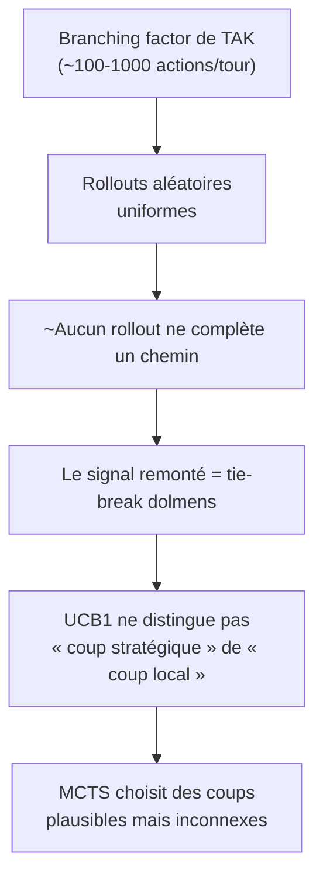

**Le verrou** : sur un jeu où compléter un chemin demande ~8 placements coordonnés, des rollouts purement aléatoires ne produisent JAMAIS de chemin complet. MCTS travaille alors sur du bruit.

La parade canonique s'appelle **heavy playout** : on remplace l'échantillonnage aléatoire par une politique faiblement guidée (par exemple Greedy comme rollout policy). C'est l'étape 5. Mais avant d'y aller, ré-implémente la baseline correctement.

---

## 2. Ce que TAK devient quand on le voit en termes MCTS

| Concept MCTS | Réalisation dans BelegTak |
|---|---|
| **État** | `Board` + pièces en main de chaque joueur + qui doit jouer |
| **Action** | `Place(piece, position)`, `Move(src, dst, amount[])` ou `Skip` |
| **Joueur courant** | `Color` (`BLACK_PLAYER` ou `WHITE_PLAYER`) |
| **Successeur** | État obtenu en appliquant l'action |
| **Terminal** | Un chemin gauche-droite OU haut-bas existe pour une couleur. OU plus aucun coup légal. |
| **Reward** | +1 si je gagne, 0 si je perds, +0.5 en cas de tie (DOLMEN_TIE / TIE_SECOND_PLAYER) |

Cette traduction n'est pas évidente sur 3 points subtils :

**Le 1er coup du round est SPÉCIAL.** Tu places un DOLMEN de la couleur ADVERSE (règle de handicap). `Player.hasPiece()` renvoie alors true uniquement pour le dolmen adverse. Donc l'« espace d'actions » au 1er tour n'a rien à voir avec les tours suivants. La plupart des implémentations court-circuitent MCTS au tour 0 (placement déterministe au centre) pour ne pas gaspiller le budget.

**L'état doit inclure les pièces en main.** Le `Board` ne sait pas combien de stones/capstones il reste à chaque joueur. Si ton MCTS oublie de tracker ça, ses rollouts placeront à l'infini et personne ne touchera jamais au tie-break.

**Le second joueur a un (léger) avantage.** Si la partie se termine en `TIE_SECOND_PLAYER` (égalité parfaite sur les dolmens au sommet), le 2e joueur gagne. Si ta fonction d'éval ou ton tie-break dans le rollout l'oublie, tu sous-estimes/sur-estimes 50% des fins de partie en simulation.

---

## 3. Inventaire de l'API

### 3.1 Ce que BelegTak te donne « gratuitement »

| Classe | Ce qu'elle fait | Limite à connaître |
|---|---|---|
| `Strategy` | Interface à implémenter (1 méthode `plays`) | Constructeur sans argument OBLIGATOIRE pour être chargée par `loadStrategies` |
| `StrategyAdapter` | Implémentations vides de `register` / `unregister` | Pratique mais n'oblige pas à hériter |
| `Board` | État du plateau + `canPlace` / `canMove` / `pathExists` / `getStack` / `clone()` | `place()` et `move()` sont **protected** : tu ne peux pas appliquer un coup sur un Board cloné |
| `Action` | Conteneur Place/Move/Skip | **N'override pas `equals()`** : compare par référence par défaut |
| `Piece` (enum) | DOLMEN/MENHIR/CAPSTONE × BLACK/WHITE | `isMenhir()` / `isDolmen()` / `isCapstone()` |
| `Player` | Nom, couleur, score, `countStones()` / `countCapstones()` | Reflète le VRAI joueur du jeu — pas ton état simulé |
| `Game` | Moteur, gestion des tours, listeners | Timeout dur (kill via Future.cancel) à chaque coup |
| `RoundListener` | `onRoundBegins(...)` te dit quand un nouveau round commence | Crucial pour reset `firstAction = true` |
| `Constants` | `BLACK_PLAYER`, `WHITE_PLAYER`, `FIRST_PLAYER`, `SECOND_PLAYER` | Singletons → comparaison `==` valide |

### 3.2 Ce qu'il faut construire (et qui est déjà dans `be.heh.math.core`)

| Composant | Rôle | Pourquoi indispensable |
|---|---|---|
| `Simulator` | Réplique de l'état du Board, mutable | `Board.place()`/`Board.move()` sont protected — il faut une copie sur laquelle on peut appliquer des coups |
| `Simulator.canPlace` / `canMove` | Validation côté Simulator | Pour générer des coups depuis un état simulé (lookahead, MCTS) |
| `Simulator.matchesBoard(Board)` | Comparaison cellule par cellule | Pour le tree reuse (retrouver le grand-enfant matchant la position courante) |
| `MoveGenerator` | Énumère tous les coups légaux | Tu en as besoin EXACTEMENT, pas un sur-ensemble (sinon = penalty) |
| `MoveGenerator.generateLegal(Simulator, Color, int stones, int caps, Color opp, bool firstAction)` | Overload qui prend des compteurs explicites | Indispensable car le vrai `Player` ne reflète pas l'état simulé |
| `Evaluator` | Score une position (utile pour Greedy ou pour des rollouts guidés) | Optionnel pour vanilla MCTS, indispensable pour heavy playouts |

### 3.3 Architecture en un schéma

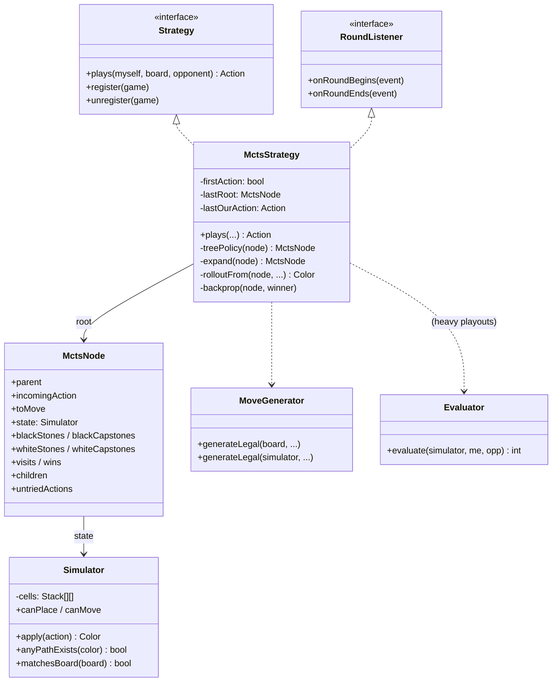

---

## 4. MCTS — l'algorithme en 4 phases

MCTS construit un arbre asymétrique de manière incrémentale. Chaque itération est une boucle des 4 phases ci-dessous, répétée jusqu'à épuisement du budget temps.

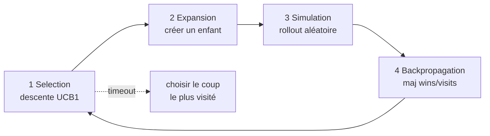

### 4.1 Phase 1 — Selection (descente UCB1)

On part de la racine. À chaque nœud, tant que tous les enfants candidats sont déjà créés, on descend dans l'enfant qui maximise la formule UCB1 :

$$
\text{UCB1}(child) = \underbrace{\frac{\text{wins}(child)}{\text{visits}(child)}}_{\text{exploitation}} + C \cdot \underbrace{\sqrt{\frac{\ln(\text{visits}(parent))}{\text{visits}(child)}}}_{\text{exploration}}
$$

- $C \approx \sqrt{2} \approx 1.41$ est la constante d'exploration. Plus elle est grande, plus MCTS explore de coups différents.
- `wins(child)` se compte du point de vue du joueur QUI A CHOISI cette action (= `parent.toMove`).
- Les enfants visités peu de fois ont une exploration élevée → on les visite en priorité.

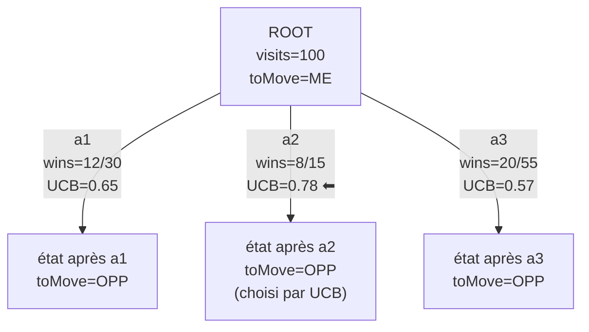

**Pseudo-code :**
```
function select(node):
    while node has children AND node is fully explored:
        node = argmax_child UCB1(child)
    return node
```

### 4.2 Phase 2 — Expansion

Quand on atteint un nœud non terminal qui n'est pas « pleinement exploré » (toutes ses actions candidates n'ont pas été essayées), on ajoute UN enfant.

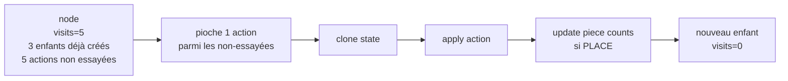

**Pseudo-code :**
```
function expand(node):
    if node.untriedActions is None:
        node.untriedActions = generateLegalActions(node.state)
    action = node.untriedActions.pop()
    childState = clone(node.state)
    childState.apply(action)
    childCounts = updatePieceCounts(node.counts, action, node.toMove)
    child = new Node(parent=node, action=action, state=childState, toMove=opposite(node.toMove), counts=childCounts)
    node.children.append(child)
    return child
```

### 4.3 Phase 3 — Simulation (rollout)

Depuis le nouvel enfant créé, on simule la suite de la partie en jouant aléatoirement jusqu'à un état terminal (ou une profondeur max).

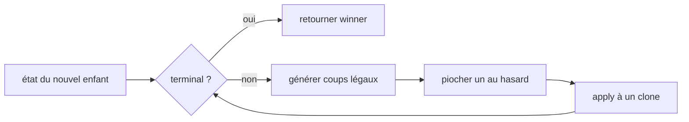

**Pseudo-code (vanilla, uniforme) :**
```
function rollout(startState, startToMove, counts):
    state = clone(startState)
    toMove = startToMove
    depth = 0
    while depth < MAX_ROLLOUT_DEPTH:
        if state.pathExists(BLACK): return BLACK
        if state.pathExists(WHITE): return WHITE
        legal = generateLegalActions(state, toMove, counts)
        if legal.empty(): return tiebreak(state)
        action = random.choice(legal)
        winner = state.apply(action)
        counts = updatePieceCounts(counts, action, toMove)
        if winner is not None: return winner
        toMove = opposite(toMove)
        depth += 1
    return tiebreak(state)
```

**Important** : `tiebreak` doit refléter la règle de fin de round du moteur (`Game.WinningReason.DOLMEN_TIE` puis `TIE_SECOND_PLAYER`). Tu comptes les dolmens au sommet pour chaque couleur ; égalité → 2e joueur gagne (ou demi-point en MCTS).

### 4.4 Phase 4 — Backpropagation

On remonte le résultat du rollout le long du chemin de la racine au nœud expansé. Chaque nœud incrémente `visits` ; le compteur `wins` est incrémenté **uniquement si le gagnant est le décideur du coup menant à ce nœud**.

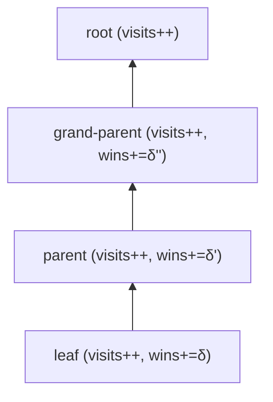

**Pseudo-code :**
```
function backprop(leaf, winner):
    node = leaf
    while node is not None:
        node.visits += 1
        if node.parent is not None:
            decider = node.parent.toMove  # qui a choisi cette action
            if winner == decider:
                node.wins += 1.0
            elif winner is None:
                node.wins += 0.5  # tie
            # sinon: pas d'incrément
        node = node.parent
```

### 4.5 Le choix final

Une fois le budget temps épuisé, on choisit le **coup le plus visité** (et non le mieux noté). C'est plus robuste statistiquement.

```
function bestMove(root):
    return argmax_child child.visits
```

---

## 5. Adaptations spécifiques à TAK

### 5.1 Progressive Widening (PW)

Sur HUGE 8×8 en milieu de partie, un nœud peut avoir **des milliers d'actions légales**. Si MCTS doit visiter chaque enfant au moins une fois avant d'avoir un estimé, il n'aura pas le temps de bien évaluer une seule action.

**Idée** : limiter le nombre d'enfants autorisés en fonction du nombre de visites du nœud.

$$
\text{enfants autorisés} = \lceil C_{PW} \cdot \sqrt{N_{\text{visites}}} \rceil
$$

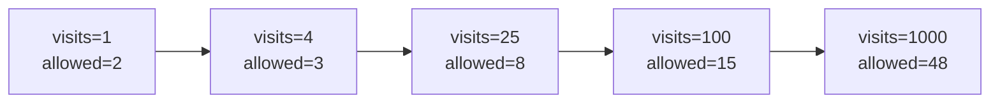

Donc au début, on visite massivement les ~2 premiers enfants (= ceux qu'on a tirés au hasard en début d'expansion). Comme ces enfants accumulent des visites, leurs propres enfants sont mieux estimés, et seulement plus tard on explore plus largement à la racine.

**Conséquence** : l'ordre dans lequel `untriedActions` est mélangée influe sur les enfants tirés en premier. Un raffinement utile est de **trier `untriedActions` par heuristique** (Evaluator) au lieu de les mélanger uniformément : on explore en priorité les coups qui ont l'air bons.

### 5.2 Tree reuse

Entre deux tours, l'adversaire joue. Si MCTS a déjà exploré cette réponse, le sous-arbre correspondant contient potentiellement des **milliers de simulations** qu'il serait gâché de jeter.

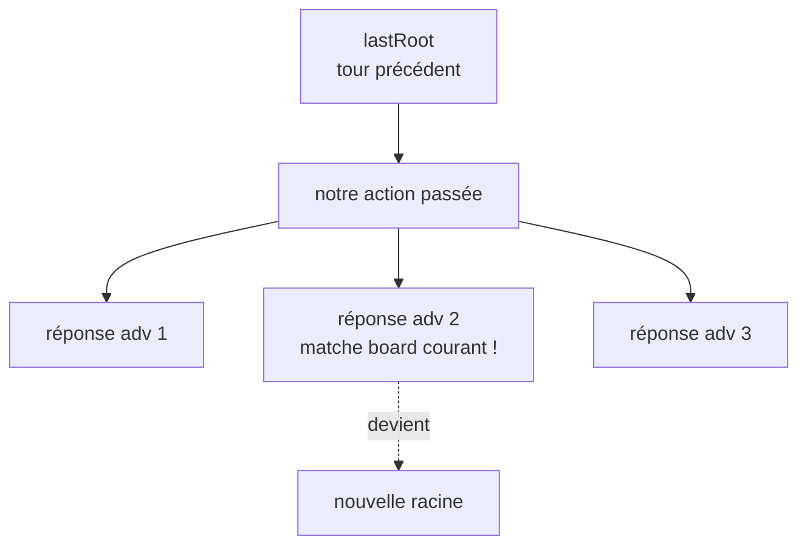

**Comment trouver le bon grand-enfant** : on stocke `lastRoot` et `lastOurAction`. Au tour suivant :
1. Trouver l'enfant de `lastRoot` correspondant à `lastOurAction` (par comparaison structurelle d'`Action`, vu qu'`equals()` n'est pas overriden).
2. Parmi ses enfants (= réponses adverses explorées), trouver celui dont le `Simulator` matche le `Board` courant via `matchesBoard(...)`.
3. Si trouvé → cet enfant devient la nouvelle racine. Sinon → on rebuild à partir de zéro.

### 5.3 Tracking des pièces en main

Le `Player` réel ne sait pas combien de pièces tu as posées en simulation. Tu DOIS tracker les comptes toi-même.

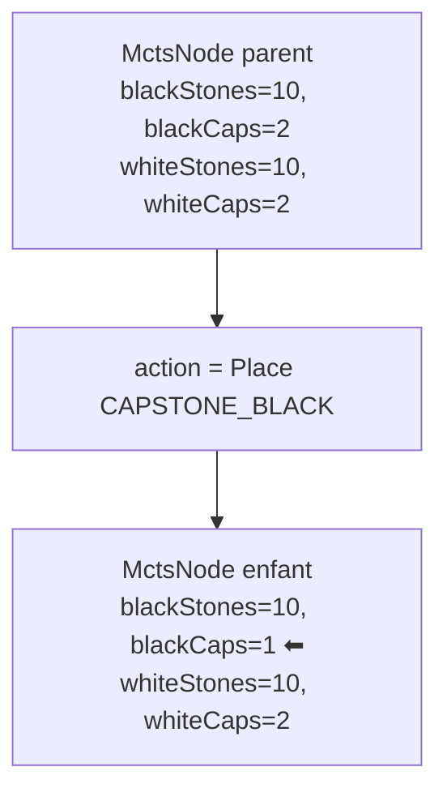

Règle : si l'action est un PLACE, décrémenter le pool du joueur qui a joué (capstone → capstones-- ; dolmen ou menhir → stones--). MOVE et SKIP ne changent rien.

Et il faut un overload de `MoveGenerator.generateLegal` qui prend les compteurs explicites (au lieu d'un `Player`), pour que le simulateur en sache aussi long que le vrai jeu.

---

## 6. Pièges spécifiques (économie de temps garantie)

| Piège | Symptôme | Solution |
|---|---|---|
| `Point.x` = colonne, `Point.y` = ligne | Tes coups générés sont valides mais bizarres | Toujours `new Point(col, row)` — quand tu lis `point.y` tu lis une ligne |
| `Board.place()` est protected | Tu ne peux pas appliquer un coup sur un clone | Réimplémente `applyPlace` / `applyMove` sur ton `Simulator` |
| `Action` n'override pas `equals()` | Tree reuse rate systématiquement | Écris un `actionsEqual(a, b)` qui compare champ par champ |
| Premier coup du round = DOLMEN adverse | MCTS génère des coups que `Player.hasPiece()` refusera | Court-circuite MCTS au tour 0 du round, place déterministe |
| Reset entre rounds | `firstAction` reste à false → coup invalide au début du round 2 | Implémente `RoundListener.onRoundBegins → firstAction = true` |
| `Color` instances singletons | Confusion `==` vs `.equals()` | Tu peux utiliser `==` car BLACK_PLAYER et WHITE_PLAYER sont des constantes |
| Rollouts trop longs | MCTS fait peu d'itérations, perd contre Greedy | Plafonne `MAX_ROLLOUT_DEPTH` (~80) et tie-break sur dolmens |
| Pieces en main désynchronisées | Rollouts qui posent à l'infini, jamais de fin | Tracker `(blackStones, blackCaps, whiteStones, whiteCaps)` dans chaque `MctsNode` |
| Budget de temps mal géré | Timeout du Game ⇒ skip + pénalité | Garde une marge (~10%) entre `TIME_BUDGET_MS` et le timeout du moteur |

---

## 7. Roadmap d'implémentation

Va dans cet ordre. Chaque étape doit produire un test passant avant la suivante.

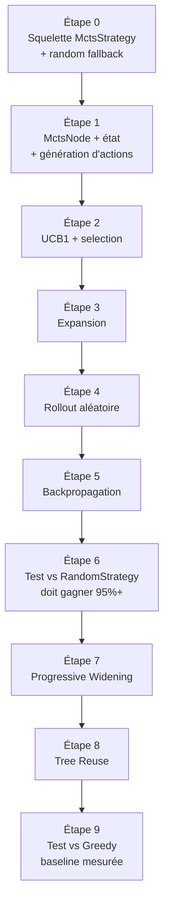

**Étape 0 — Squelette en 30 lignes.** Implémente `plays()` qui retourne un coup aléatoire légal (essentiellement NaiveStrategy). Lance le tournoi. Si ça compile et joue sans erreur, tu as une base saine.

**Étape 1 — `MctsNode` + état.** Crée la classe interne avec tous les champs (parent, incomingAction, toMove, state Simulator, piece counts, visits, wins, children, untriedActions). Crée la racine dans `plays()` mais ne lance pas encore MCTS — retourne toujours un coup aléatoire.

**Étape 2 — Selection + UCB1.** Écris `select()` qui descend dans l'arbre tant qu'il y a des enfants visités. Pour les premières itérations, l'arbre n'a qu'une racine donc `select()` retourne juste la racine. Ne le teste pas encore : c'est plus simple avec l'étape 3.

**Étape 3 — Expansion.** Écris `expand()`. Maintenant tu peux ajouter des enfants à la racine. `plays()` fait UN cycle select → expand → ... mais sans rollout encore, retourne un coup aléatoire.

**Étape 4 — Rollout.** Écris `rolloutFrom()` qui simule jusqu'à victoire ou MAX_DEPTH, retourne la couleur gagnante (ou null pour tie). Vérifie isolément sur quelques positions de test.

**Étape 5 — Backpropagation.** Écris `backprop()`. Maintenant ferme la boucle MCTS dans `plays()`. Lance un tournoi de validation : MCTS doit battre RandomStrategy à plus de 95% (sinon il y a un bug).

**Étape 6 — Test vs Random.** Si tu n'es pas à 95%+, debug avant d'avancer. Causes typiques : `wins` incrémenté du mauvais côté, rollout qui ne décompte pas les pièces, `actionsEqual` incorrect.

**Étape 7 — Progressive Widening.** Ajoute la limite `allowed = ⌈C · √visites⌉` dans la boucle de `select`. Plus de différence visible sur HUGE.

**Étape 8 — Tree Reuse.** Stocke `lastRoot` et `lastOurAction`. À chaque appel de `plays()`, essaie de retrouver le sous-arbre via `matchesBoard`. Mesure : avec tree reuse, le nombre d'itérations MCTS du 2e tour devrait être >> celui du 1er (puisque l'arbre est déjà partiellement construit).

**Étape 9 — Mesure contre Greedy.** À ce stade, MCTS vanilla devrait probablement perdre contre Greedy (30-50%). C'est NORMAL. La suite (heavy playouts) vise à inverser ça.

---

## 8. Pour aller plus loin : heavy playouts

C'est l'étape qui devrait te faire passer devant Greedy.

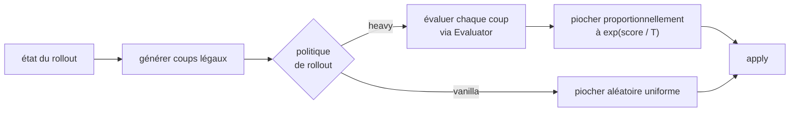

L'idée : au lieu de tirer un coup uniformément, tu pondères chaque coup légal par `exp(score(coup) / T)` (softmax sur l'évaluation). Avec `T` (température) grande, c'est presque uniforme ; avec `T` petite, c'est quasi greedy.

**Effet** : les rollouts deviennent **statistiquement compétents** — ils ressemblent à des parties réelles et atteignent des positions terminales bien plus souvent. Le signal qui remonte vers la racine est beaucoup plus informatif.

**Trade-off** : chaque rollout est plus cher (une évaluation par coup légal), donc tu fais moins d'itérations dans le même budget. La question empirique : est-ce que la meilleure qualité du signal compense la baisse en quantité ? **Sur TAK, oui, clairement.** C'est ce qui transforme une IA qui ramasse contre Greedy en une IA qui le bat.

D'autres améliorations à envisager après :
- **RAVE / AMAF** : partage d'information entre branches du même nœud (mêmes actions à différents endroits de l'arbre). Gain pédagogique : tu vois MCTS s'auto-renforcer.
- **Sélection orientée par éval pour PW** : trier `untriedActions` par `Evaluator.evaluate(after action)` au lieu de mélanger.
- **Domain-specific killer moves** : forcer la racine à TOUJOURS considérer les coups qui complètent ton chemin ou bloquent celui de l'adversaire, avant tout autre filtre.

---

## 9. Mini checklist mentale

Avant de te dire « MCTS marche » :

- [ ] `MctsStrategy` est chargée par `BelegTak.loadStrategies("be.heh")` (apparaît dans l'UI).
- [ ] 0 invalid action, 0 invalid piece, 0 exception sur 100 parties contre Random.
- [ ] Win rate ≥ 95% contre Random.
- [ ] Le 1er coup du round est toujours un placement de dolmen adverse, sans crash.
- [ ] Le 2e round commence sans état résiduel du 1er (RoundListener correct).
- [ ] Itérations MCTS du 1er coup d'un round < itérations du 2e coup (preuve de tree reuse).
- [ ] Aucun timeout sur 100 parties avec un budget de 1s/coup.
- [ ] Au moins une fois, tu as observé une victoire par PATH_COMPLETED de TES dolmens.

Tu peux ouvrir cette doc en parallèle pendant que tu codes. Bon courage.
