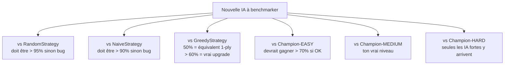

# Guide d'optimisation ReflexStrategy + design du benchmark

Document destiné à toi qui vas implémenter les étapes 8 à 11 et un Champion comme étalon de benchmark.

Sommaire :
1. Étape 8 — Alpha-beta pruning (pseudo-code)
2. Étape 9 — Profondeur variable (récursion)
3. Étape 10 — Iterative deepening + move ordering
4. Étape 11 — Killer moves + transposition table
5. **ChampionStrategy** : le sparring partner ultime pour benchmarker tes IA

---

## Étape 8 — Alpha-beta pruning

### L'intuition

Tu as déjà du 2-ply minimax. À chaque coup `m`, tu calcules `worstOpponentReward` (le MIN sur les réponses adverses). Et au niveau supérieur, tu prends le MAX.

**Alpha-beta** ajoute deux bornes qui voyagent avec la recherche :
- `alpha` = le score MINIMAL que tu es sûr de garantir à la racine (ce que tu as déjà trouvé de mieux jusqu'ici).
- `beta` = le score MAXIMAL que l'adversaire est prêt à te laisser (ce qu'il a déjà trouvé de pire pour toi).

**Le cutoff** : dès que `alpha >= beta` dans un sous-arbre, on coupe. Pourquoi ? Parce que l'autre joueur n'aurait jamais laissé cette branche se réaliser.

### Pseudo-code minimal (2-ply seul, juste pour comprendre)

```
function chooseMove(board, myself, opponent):
    legal = MoveGenerator.generateLegal(board, myself, opponent, false)
    bestAction = legal[0]
    alpha = -INFINITY           # mon meilleur score garanti
    
    POUR chaque m dans legal :
        simMe = clone(board); winnerM = simMe.apply(m)
        SI winnerM == myColor → return m
        SI winnerM == oppColor → continue
        
        # MIN sur les réponses adverses, avec cutoff alpha
        worstAfterOpp = +INFINITY
        oppLegal = MoveGenerator.generateLegal(simMe, opponent, myself, false)
        POUR chaque r dans oppLegal :
            simOpp = clone(simMe); winnerR = simOpp.apply(r)
            SI winnerR == oppColor :
                worstAfterOpp = -INFINITY; break
            SI winnerR == myColor :
                continue
            scoreAfterR = Evaluator.evaluate(simOpp, myself, opponent)
            SI scoreAfterR < worstAfterOpp :
                worstAfterOpp = scoreAfterR
            
            # ← CUTOFF ALPHA : opp peut déjà me forcer en-dessous de mon alpha actuel.
            # Donc m sera pire que ce que j'ai en main. Inutile de continuer.
            SI worstAfterOpp <= alpha :
                break
        
        SI worstAfterOpp > alpha :
            alpha = worstAfterOpp
            bestAction = m
    
    return bestAction
```

**La seule ligne nouvelle vs 2-ply classique** : `SI worstAfterOpp <= alpha → break`. Et `alpha = worstAfterOpp` (au lieu de `bestReward`).

### Test de performance

À iso-qualité, alpha-beta coupe 30 à 70 % des branches. Tu peux mesurer avec un compteur de simulations : ajoute un `int counter` que tu incrémentes à chaque `new Simulator(sim)`. Compare avec / sans cutoff.

---

## Étape 9 — Profondeur variable (récursion)

Pour aller au-delà de 2-ply, il faut sortir de la double boucle et passer à la récursion.

### Pseudo-code

```
function chooseMove(board, myself, opponent, MAX_DEPTH):
    legal = MoveGenerator.generateLegal(board, myself, opponent, false)
    bestAction = legal[0]
    alpha = -INFINITY
    beta  = +INFINITY
    rootSim = new Simulator(board)
    
    POUR chaque m dans legal :
        sim = clone(rootSim); winner = sim.apply(m)
        SI winner == myColor → return m
        SI winner == oppColor → continue
        
        # On entre dans la récursion pour le tour de l'adversaire (minimizing)
        score = alphaBeta(sim, depth = MAX_DEPTH - 1,
                          alpha, beta, maximizing = false,
                          myColor, oppColor,
                          myStones - (m est PLACE non capstone ? 1 : 0),
                          myCaps   - (m est PLACE capstone     ? 1 : 0),
                          oppStones, oppCaps)
        
        SI score > alpha :
            alpha = score
            bestAction = m
    
    return bestAction


function alphaBeta(state, depth, alpha, beta, maximizing,
                    myColor, oppColor,
                    myStones, myCaps, oppStones, oppCaps):
    
    SI depth == 0 :
        return Evaluator.evaluate(state, myColor)
    
    # À ce niveau, qui joue ?
    current = maximizing ? myColor : oppColor
    other   = maximizing ? oppColor : myColor
    curStones = maximizing ? myStones : oppStones
    curCaps   = maximizing ? myCaps   : oppCaps
    
    legal = MoveGenerator.generateLegal(state, current, curStones, curCaps, other, false)
    SI legal vide → return Evaluator.evaluate(state, myColor)
    
    SI maximizing :       # = mon tour (je veux maximiser)
        value = -INFINITY
        POUR chaque a dans legal :
            next = clone(state); winner = next.apply(a)
            SI winner == myColor → return WIN_REWARD - (MAX_DEPTH - depth)  # victoire RAPIDE préférée
            SI winner == oppColor → continue
            
            # Update piece counts pour la recursion
            nMyS = myStones - (a PLACE non-capstone ? 1 : 0)
            nMyC = myCaps   - (a PLACE capstone     ? 1 : 0)
            
            childValue = alphaBeta(next, depth - 1, alpha, beta, false,
                                    myColor, oppColor,
                                    nMyS, nMyC, oppStones, oppCaps)
            SI childValue > value : value = childValue
            SI value > alpha      : alpha = value
            SI alpha >= beta      : break    # CUTOFF
        return value
    
    SINON :               # = tour adverse (il veut minimiser mon score)
        value = +INFINITY
        POUR chaque a dans legal :
            next = clone(state); winner = next.apply(a)
            SI winner == oppColor → return LOSS_PENALTY + (MAX_DEPTH - depth)  # défaite LENTE préférée
            SI winner == myColor → continue
            
            nOpS = oppStones - (a PLACE non-capstone ? 1 : 0)
            nOpC = oppCaps   - (a PLACE capstone     ? 1 : 0)
            
            childValue = alphaBeta(next, depth - 1, alpha, beta, true,
                                    myColor, oppColor,
                                    myStones, myCaps, nOpS, nOpC)
            SI childValue < value : value = childValue
            SI value < beta       : beta = value
            SI alpha >= beta      : break    # CUTOFF
        return value
```

### Notes clés

- **Piece counts** : ne JAMAIS oublier de les décrémenter pour les actions PLACE en simulation. Sinon `MoveGenerator` génère plus de coups qu'autorisé en profondeur, ce qui pourrit l'éval.

- **Préférer victoires rapides / défaites lentes** : `WIN_REWARD - (MAX_DEPTH - depth)` fait préférer une victoire en 2 coups vs 4 coups. Important pour ne pas "traîner" sur une victoire évidente.

- **Choix de `MAX_DEPTH`** : 3 sur HUGE, 4 sur LARGE, 5 sur MEDIUM dans un budget de 1-2 s. À calibrer en bench.

---

## Étape 10 — Iterative deepening + move ordering

### L'idée

Au lieu de fixer `MAX_DEPTH = 4`, on cherche d'abord à profondeur 1, puis 2, puis 3, etc. Deux gains :

1. **Robustesse au timeout** : si on dépasse le budget en plein milieu de la profondeur 4, on retourne le meilleur coup de la profondeur 3 — jamais un coup à moitié exploré.

2. **Move ordering gratuit** : le meilleur coup à la profondeur N est probablement aussi très bon à N+1. En le testant en PREMIER à la profondeur N+1, alpha monte vite et alpha-beta coupe massivement le reste.

### Pseudo-code

```
function chooseMove(board, myself, opponent):
    legal = MoveGenerator.generateLegal(board, myself, opponent, false)
    SI legal vide → return Skip
    
    bestAction = legal[0]
    deadline = now() + TIME_BUDGET_MS
    
    POUR depth de 1 à MAX_DEPTH_THEORIQUE :
        SI now() >= deadline → break
        
        # Move ordering : meilleur coup de l'itération précédente en premier
        ordered = legal.copy()
        IF bestAction dans ordered :
            ordered.remove(bestAction)
            ordered.add_at_front(bestAction)
        
        depthBest = null
        depthBestScore = -INFINITY
        alpha = -INFINITY
        beta  = +INFINITY
        timeout = false
        
        POUR chaque m dans ordered :
            SI now() >= deadline :
                timeout = true; break
            
            # ... mêmes étapes que dans étape 9 (récursion alphaBeta)
            score = alphaBeta(...)
            SI now() >= deadline :       # le child a peut-être détecté le timeout
                timeout = true; break
            
            SI score > depthBestScore :
                depthBestScore = score
                depthBest = m
            SI score > alpha : alpha = score
        
        # On ne valide cette profondeur que si elle s'est TERMINÉE complètement
        SI NOT timeout AND depthBest != null :
            bestAction = depthBest
        SI timeout : break
        SI depthBestScore >= WIN_REWARD / 2 : break    # victoire forcée détectée
    
    return bestAction
```

### Détection du timeout dans la récursion

Tu propages la deadline jusque dans `alphaBeta` (passée comme paramètre ou stockée comme champ de la classe). À chaque entrée de `alphaBeta`, tu testes `if (now() >= deadline) return eval(state)` pour court-circuiter.

Bonus : un flag `boolean timedOut` partagé qui est mis à true quand on dépasse, permet au root de savoir si la profondeur s'est terminée proprement.

---

## Étape 11 — Killer moves + transposition table

### Killer moves

Un "killer move" est un coup qui a causé un cutoff alpha-beta à un certain niveau de profondeur. L'intuition : si ce coup était bon dans une autre branche, il sera probablement bon ici aussi.

**Structure** : un tableau `Action[][] killers` indexé par `[depth][slot]` où slot ∈ {0, 1} (on garde les 2 derniers killers par niveau).

```
function alphaBeta(state, depth, alpha, beta, maximizing, ...):
    ...
    legal = generateLegal(...)
    
    # MOVE ORDERING : on met les killers de ce niveau en premier
    ordered = []
    IF killers[depth][0] in legal : ordered.add(killers[depth][0])
    IF killers[depth][1] in legal : ordered.add(killers[depth][1])
    pour chaque a in legal :
        IF a not in ordered : ordered.add(a)
    
    pour chaque a in ordered :
        ... (simu, recurse) ...
        SI alpha >= beta :
            # CUTOFF : enregistre a comme killer pour ce niveau
            SI killers[depth][0] != a :
                killers[depth][1] = killers[depth][0]
                killers[depth][0] = a
            break
    ...
```

**Effet** : 20-40 % de cutoffs supplémentaires sur les positions tactiques répétitives.

### Transposition table (TT)

Plusieurs séquences de coups peuvent mener au même état. Sans TT, on les évalue plusieurs fois. La TT cache les évaluations.

**Structure** :

```
class TTEntry:
    long hash             # hash de l'état
    int value             # score retourné
    int depth             # à quelle profondeur on a calculé ce score
    EntryType type        # EXACT / LOWER (alpha cutoff) / UPPER (beta cutoff)
    Action bestMove       # le coup qui a donné ce score (pour move ordering)
```

**Pré-requis** : ton `Simulator` doit pouvoir produire un hash de son état. Ajoute une méthode :

```
function Simulator.computeHash() :
    h = 0
    pour chaque cellule (row, col) du plateau :
        stackHash = 0
        pour chaque pièce dans la pile (du bas vers le haut) :
            stackHash = stackHash * 31 + piece.ordinal()
        h = h * 17 + stackHash
        h = h * 17 + (row * size + col)
    return h
```

Encore mieux : **Zobrist hashing**. On pré-calcule un long aléatoire `Z[row][col][pieceType]` au démarrage. Le hash devient `XOR de Z[row][col][topPiece(row,col)]` sur les cellules non vides. Avantage : hash incrémental ultra-rapide.

**Usage dans alphaBeta** :

```
function alphaBeta(state, depth, alpha, beta, maximizing, ...):
    hash = state.computeHash()
    
    # LOOKUP TT
    entry = TT.get(hash)
    SI entry != null AND entry.depth >= depth :
        SI entry.type == EXACT          → return entry.value
        SI entry.type == LOWER AND entry.value >= beta  → return entry.value
        SI entry.type == UPPER AND entry.value <= alpha → return entry.value
    
    # Move ordering : si on a une bestMove en cache, on l'essaye en premier
    bestMoveFromTT = entry?.bestMove
    
    # ... recherche normale, avec bestMoveFromTT en premier dans ordered
    
    # STORE TT
    type = (value <= originalAlpha) ? UPPER
         : (value >= beta)          ? LOWER
         :                            EXACT
    TT.put(hash, new TTEntry(hash, value, depth, type, bestActionLocal))
    
    return value
```

**Taille de la TT** : 1-10 millions d'entrées sur TAK c'est confortable. Utiliser un `HashMap<Long, TTEntry>` ou (mieux) un `long[]` + `TTEntry[]` indexé par `hash % size`.

**Effet** : gain massif sur les parties longues, particulièrement en endgame.

---

## ChampionStrategy — l'étalon de benchmark

Tu veux mesurer la progression de tes IA. Pour ça, il te faut un sparring partner FORT, déterministe et configurable.

### Cahier des charges

| Critère | Choix |
|---|---|
| Algorithme | Alpha-beta + iterative deepening + killer moves + TT |
| Profondeur cible | 5 sur MEDIUM, 4 sur LARGE, 3 sur HUGE |
| Budget temps | Configurable (`STRENGTH_LEVEL`) |
| Déterministe | Oui — pas de Random ; ordre stable des actions |
| Niveau de force | 3 modes : EASY / MEDIUM / HARD |

### Structure

```
public class ChampionStrategy implements Strategy, RoundListener:

    enum Level:
        EASY    { TIME_MS = 100,  MAX_DEPTH = 2 }
        MEDIUM  { TIME_MS = 2000, MAX_DEPTH = 4 }
        HARD    { TIME_MS = 15000, MAX_DEPTH = 6 }
    
    Level level = Level.HARD     # par défaut, hard
    
    # Le reste = exactement la même structure que ReflexStrategy étape 11
    # avec alpha-beta + iterative deepening + killers + TT
```

### Comparaison plus fine via un système ELO maison

Quand tu fais des tournois entre tes IA, regarde aussi les ratios non binaires :
- `(wins + 0.5 × ties) / total` te donne un score plus précis qu'un simple win rate
- Sur 200 parties contre Champion-MEDIUM, tu auras une marge d'erreur d'environ ±5 %

### Suite de benchmark recommandée

Pour situer une nouvelle IA, lance-la contre cette grille :



### Pseudo-code d'un BenchmarkRunner

```
function benchmark(strategyClass) :
    opponents = [RandomStrategy, NaiveStrategy, GreedyStrategy,
                  ChampionEasy, ChampionMedium, ChampionHard]
    sizes = [MEDIUM, LARGE]
    
    pour chaque size dans sizes :
        pour chaque opp dans opponents :
            résultats = jouer 100 parties strategyClass vs opp sur size
            imprimer "(%s, %s) → %d%% wins" % (size, opp, winRate)
```

Tu peux le coder comme variante de ton `TournamentRunner` actuel : une boucle externe sur la liste d'opponents.

---

## Plan d'action conseillé

```mermaid
flowchart LR
    A[Tu es ici<br>2-ply minimax] --> B[8. Alpha-beta<br>même qualité, 2-3x rapide]
    B --> C[9. Profondeur variable<br>récursion N-ply]
    C --> D[10. Iterative deepening<br>+ move ordering]
    D --> E[11a. Killer moves<br>+25-40% de cutoffs]
    E --> F[11b. Transposition table<br>gain massif endgame]
    F --> G[Coder ChampionStrategy<br>EASY / MEDIUM / HARD]
    G --> H[BenchmarkRunner<br>une grille de matches]
```



Chaque étape doit être :
1. Codée seule
2. Validée par un tournoi (ton win rate vs Greedy doit MONTER à chaque étape)
3. Loggée — note les chiffres pour comparer

Quand tu as l'étape 8 qui tourne, dis-moi le nouveau win rate et on attaque la 9.
